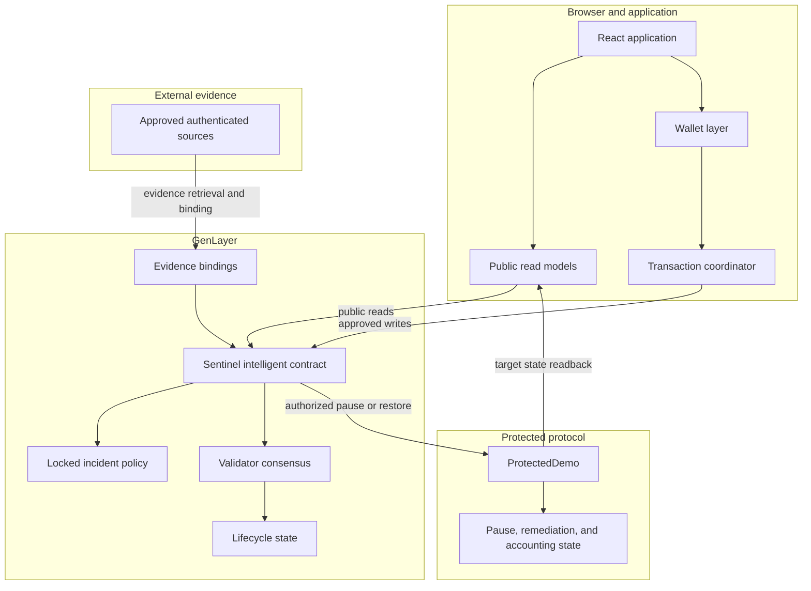
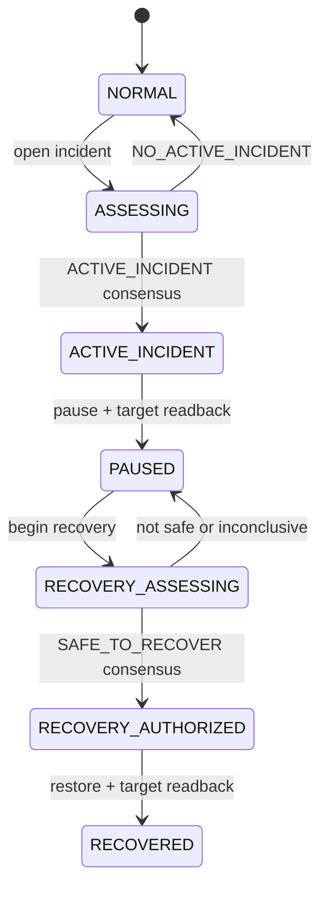
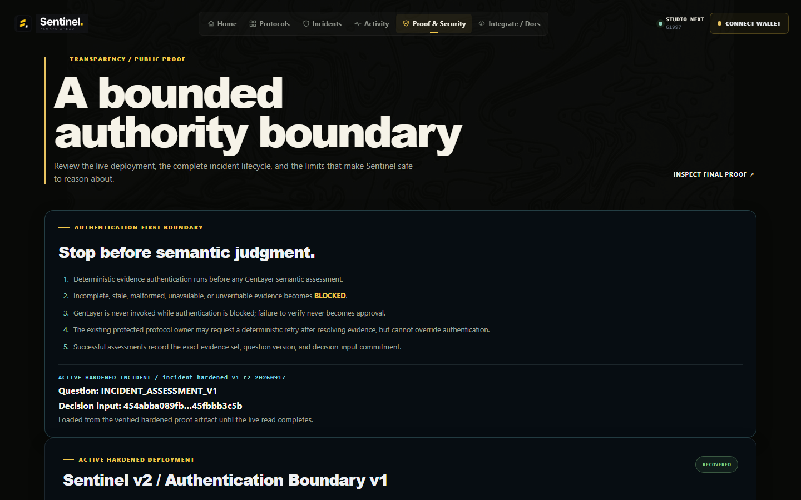

<p align="center">
  
</p>

<h1 align="center">Sentinel</h1>

<p align="center"><strong>Autonomous Incident Response for Onchain Protocols</strong></p>

<p align="center">Authenticated evidence. Independent consensus. Verified containment and recovery.</p>

<p align="center">
  <a href="https://sentinel-zeta-blush.vercel.app">Live App</a> ·
  <a href="docs/ARCHITECTURE.md">Architecture</a> ·
  <a href="deploy/evidence/hardened-v1/HARDENED_DEPLOYMENT.txt">Deployment</a> ·
  <a href="deploy/evidence/hardened-v1/HARDENED_END_TO_END_PROOF.txt">Verification</a> ·
  <a href="https://github.com/GIFTEDLOV/sentinel-evidence">Evidence</a>
</p>

<!-- README HERO SCREENSHOT -->

## What Sentinel is

Sentinel is evidence-backed autonomous incident-response infrastructure for onchain protocols.

A protected protocol explicitly opts in to Sentinel. When an operational failure is reported, Sentinel:

1. authenticates external evidence against the locked protocol policy;
2. asks GenLayer validators to independently assess whether the evidence establishes an active incident;
3. reaches a consensus verdict;
4. executes authorized containment;
5. verifies that containment actually occurred through target-state readback;
6. preserves the incident as an auditable record;
7. verifies remediation;
8. separately assesses recovery evidence;
9. authorizes restoration only when the recovery conditions are independently satisfied; and
10. verifies that the target has returned to the intended state.

Sentinel is not simply “AI decides to pause a contract.” It is a bounded evidence → judgment → state transition system with narrow validator authority and explicit target-state verification.

## Sentinel at a glance

| Area | Verified implementation |
| --- | --- |
| Track | Autonomous Protocols |
| Network | GenLayer Studio Next |
| Chain ID | 61997 |
| Primary capability | Autonomous incident containment and recovery |
| Evidence model | Authenticated multi-source operational evidence |
| Judgment model | Bounded GenLayer validator semantic assessment |
| Fail policy | Fail closed on unauthenticated, insufficient, or inconclusive evidence |
| Containment | Preauthorized target pause |
| Recovery | Independent recovery assessment with verified restoration |
| Frontend | Vite + React |
| Transaction safety | Persisted same-hash reconciliation; no blind rebroadcast |
| Final lifecycle state | `RECOVERED` |

## Contents

- [What Sentinel is](#what-sentinel-is)
- [Sentinel at a glance](#sentinel-at-a-glance)
- [Why Sentinel](#why-sentinel)
- [Why GenLayer](#why-genlayer)
- [Core design principles](#core-design-principles)
- [How Sentinel works](#how-sentinel-works)
- [Trust model](#trust-model)
- [Evidence model](#evidence-model)
- [Architecture](#architecture)
- [Incident lifecycle](#incident-lifecycle)
- [Incident state and target state](#incident-state-and-target-state)
- [Recovery is a first-class protocol](#recovery-is-a-first-class-protocol)
- [Transaction safety](#transaction-safety)
- [Final verified deployment](#final-verified-deployment)
- [End-to-end proof](#end-to-end-proof)
- [Security properties](#security-properties)
- [Application](#application)
- [Technology](#technology)
- [Verification and testing](#verification-and-testing)
- [Repository structure](#repository-structure)
- [Local development](#local-development)
- [Verify Sentinel in 5 minutes](#verify-sentinel-in-5-minutes)
- [Limitations](#limitations)
- [Status](#status)

## Why Sentinel

Onchain state is deterministic. Real-world operational evidence is not.

A contract can read a storage slot, compare an integer, or enforce an authorization check. It cannot independently answer questions such as:

- Is an API actually unavailable?
- Is a service returning materially invalid responses?
- Do multiple authenticated reports establish a live incident?
- Has remediation resolved the underlying operational failure?
- Is recovery evidence sufficient to restore operation safely?

Conventional smart contracts can execute deterministic consequences, but they do not natively make bounded semantic judgments over authenticated offchain evidence. Sentinel bridges that gap while keeping the resulting authority narrow, policy-bound, and observable.

## Why GenLayer

Sentinel needs validators to make bounded semantic judgments about evidence that cannot be reduced to a simple deterministic oracle value.

| Question type | Example |
| --- | --- |
| Deterministic | “What value is stored at this contract slot?” |
| Semantic | “Do these authenticated reports establish an active incident under the locked incident policy?” |

For the semantic question, multiple GenLayer validators independently evaluate the locked policy and the authenticated evidence. Consensus selects an agreed outcome that the Sentinel contract can use in its guarded lifecycle.

The boundary is deliberate:

- authentication and deterministic policy checks happen before a verdict is accepted;
- validators assess the bounded semantic question rather than inventing evidence;
- validator authority is limited to the defined verdict set and contract-gated transitions;
- consensus does not turn unauthenticated data into trusted evidence; and
- invalid, unavailable, conflicting, or inconclusive evidence fails closed.

The incident assessment verdict set is:

```text
ACTIVE_INCIDENT
NO_ACTIVE_INCIDENT
INCONCLUSIVE
```

The recovery assessment verdict set is:

```text
SAFE_TO_RECOVER
NOT_SAFE_TO_RECOVER
INCONCLUSIVE
```

## Core design principles

| Principle | Sentinel implementation |
| --- | --- |
| Authenticate before adjudicating | Evidence is checked against the locked target, incident, source, freshness, digest, schema, and policy context before it can support a verdict. |
| Narrow model authority | Validators judge the locked semantic question; lifecycle transitions remain contract-gated. |
| Fail closed | Insufficient, invalid, unavailable, conflicting, or inconclusive evidence cannot authorize dangerous transitions. |
| State transition is not assumed | An incident or recovery verdict authorizes a guarded action; it does not claim that the protected target already changed state. |
| Readback establishes reality | Sentinel claims `PAUSED` only after target state proves paused, and claims `RECOVERED` only after restoration is confirmed by target readback. |
| Incident and recovery are separate judgments | Recovery has its own evidence, freshness checks, and GenLayer assessment. Incident evidence is not silently reused. |
| Automation without unilateral power | No single frontend operator or validator unilaterally decides the complete incident and restoration path. |

## How Sentinel works

The core lifecycle is intentionally explicit:

```text
Authenticate evidence
        ↓
Assess incident
        ↓
GenLayer consensus
        ↓
Contain / pause
        ↓
Verify target state
        ↓
Verify remediation
        ↓
Authenticate recovery evidence
        ↓
Assess recovery
        ↓
GenLayer consensus
        ↓
Restore
        ↓
Verify target state
```


## Trust model

Sentinel separates evidence, judgment, execution, and observation. Each component has a defined authority boundary.

| Component | Authority | Not allowed to decide |
| --- | --- | --- |
| Evidence source | Provides source-specific operational evidence | Does not determine protocol state or authorize a target action |
| Evidence authentication layer | Verifies source identity/provenance, target and incident binding, freshness, digest, schema, and policy constraints | Does not replace semantic assessment |
| GenLayer validator | Judges the locked policy against authenticated evidence | Does not authenticate arbitrary data or bypass target authorization |
| Sentinel intelligent contract | Coordinates evidence binding, verdicts, lifecycle guards, and authorized target actions | Does not invent evidence or claim a target state without readback |
| Protected target | Exposes actual pause, remediation, and accounting state | Does not determine incident semantics |
| Frontend | Presents public state, prepares user-approved writes, and resumes safe transaction tracking | Is not authoritative protocol truth |
| Wallet | Approves the user’s transaction request | Does not decide incident or recovery policy |
| Transaction transport | Delivers a signed transaction and exposes its hash/status | Does not make an ambiguous broadcast safe to repeat |
| User/operator | Initiates an explicitly available action and reviews state | Cannot override locked policy or target authorization through the UI |

## Evidence model

Authentication is separate from semantic judgment.

```text
Source
  → retrieve evidence
  → normalize
  → authenticate identity and provenance
  → bind target, incident, phase, freshness, digest, and policy facts
  → semantic assessment
```

The locked `sentinel-demo` policy requires at least two evidence sources, distinct approved source domains, and evidence no older than 3,600 seconds. The final deployment binds both incident and recovery evidence to the relevant incident and phase, with source distinction, freshness, authentication, and immutable digests recorded in the proof artifacts.

The important boundary is that source material remains untrusted until it satisfies the deterministic binding and authentication rules. GenLayer then assesses the resulting facts against the locked incident or recovery policy. An unavailable or inconclusive source cannot be promoted into authorization by consensus.

## Architecture



### Component responsibilities

| Component | Responsibility |
| --- | --- |
| `contracts/sentinel.py` | Stores locked protocol policy, binds evidence, coordinates incident and recovery verdicts, guards lifecycle transitions, and calls the authorized target actions. |
| `contracts/protected_demo.py` | Demonstration protected target with pause/unpause controls, remediation state, processing, outflow protection, and accounting readbacks. |
| `frontend/src/app.tsx` | Defines the active application shell, top-level navigation, route pages, wallet context, and incident command-center presentation. |
| `frontend/src/lib/app-data.ts` | Performs read-only protocol, incident, evidence, target-state, dashboard, and proof-ledger reads. |
| `frontend/src/config/finalDeployment.ts` | Holds the verified Studio Next deployment context, policy values, evidence references, and proof transaction hashes used by the UI. |
| `frontend/src/lib/genlayer-network.ts` | Defines the Studio Next chain and RPC configuration used by the frontend. |
| `frontend/src/lib/StudioNextTransaction.tsx` | Active transaction UI for fee receipt, wallet approval, progress, safe recovery, and user-facing transaction status. |
| `frontend/src/lib/active-transaction.ts` | Connects the active UI to the transaction lifecycle runner and persisted pending-transaction store. |
| `frontend/src/lib/transaction-lifecycle.ts` | Implements estimate, single broadcast, immediate hash persistence, same-hash reconciliation, finality, execution-result checks, and read-only verification retry. |
| `deploy/evidence/final-v5/` | Contains the final deployment record, end-to-end proof, JSON proof data, and lost-run reconstruction. |

## Incident lifecycle



The states are not interchangeable:

- `NORMAL` means no active incident is being enforced for the protocol.
- `ASSESSING` means an incident exists and is awaiting incident assessment.
- `ACTIVE_INCIDENT` means consensus established the incident under the locked policy. It does not yet mean the target is paused.
- `PAUSED` means the authorized pause was executed and target readback proved that the target is paused.
- `RECOVERY_ASSESSING` means recovery has started and requires new recovery evidence and assessment.
- `RECOVERY_AUTHORIZED` means recovery consensus permits restoration. It does not yet mean the target has been restored.
- `RECOVERED` means restoration was executed and target readback proved that the target is no longer paused. In the final proof, this is accompanied by verified remediation state.

## Incident state and target state

Sentinel lifecycle state and protected-contract state are separate observations. For example, this intermediate condition is valid:

```text
Incident verdict: ACTIVE_INCIDENT
Target paused: false
```

The verdict authorizes the next guarded action; it does not establish that the action has succeeded.

```text
PAUSED
requires
target.paused == true
```

```text
RECOVERED
requires
target.paused == false
```

This separation prevents Sentinel from claiming an effect merely because a decision was made. The final deployment also verifies the applicable remediation state independently in the protected target readback.

## Recovery is a first-class protocol

Many incident-response systems stop at detection or containment. Sentinel treats restoration as a separate protocol:

```text
Incident
  → Containment
  → Remediation
  → Recovery evidence
  → Recovery consensus
  → Restoration
  → Verified final state
```

Recovery uses its own verdict set:

```text
SAFE_TO_RECOVER
NOT_SAFE_TO_RECOVER
INCONCLUSIVE
```

Starting recovery clears the prior incident evidence bindings for the recovery phase. The target must receive new, authenticated, fresh, distinct-domain recovery evidence. That evidence must satisfy the recovery policy before `SAFE_TO_RECOVER` can authorize restoration. The incident evidence that justified containment is not silently reused to justify unpausing.

## Transaction safety

The active frontend transaction path follows this lifecycle:

```text
PRECONDITION READ
→ ESTIMATE / PREPARE
→ WALLET APPROVAL
→ BROADCAST ONCE
→ PERSIST HASH
→ RECONCILE SAME HASH
→ FINALIZED
→ EXECUTION SUCCESS
→ STATE REREAD
→ NEXT ACTION
```

The active UI uses `StudioNextTransaction`, `active-transaction.ts`, and the tested lifecycle coordinator in `transaction-lifecycle.ts`.

### Broadcast once

Once a transaction hash exists, ambiguity is resolved by tracking that transaction. Sentinel does not resolve an RPC or tracking timeout by blindly broadcasting another transaction.

### Persist before tracking

The hash is persisted immediately with network/chain, action type, protocol or incident context, and target context before long-running tracking begins. The pending record survives React reconstruction and is backed by browser storage; it contains no wallet secret.

### Same-hash recovery

Timeouts, reloads, temporary RPC failures, and temporary connection loss restore the pending record and reconcile the original hash. Recovery controls operate on that hash only.

### Finality is not success

`FINALIZED` is a transport/finality result, not an execution-success claim. The coordinator inspects the finalized execution result before advancing the workflow.

### Execution is not enough

After successful execution, the UI rereads the expected protocol, incident, or target state. Completion is claimed only when the expected state is verified.

### Readback failure

If execution succeeded but the state read is temporarily unavailable, retry performs a read-only verification. It preserves the successful transaction hash and never re-estimates or rebroadcasts.

## Final verified deployment — active hardened release

| Field | Value |
| --- | --- |
| Network | Studio Next |
| Chain ID | `61997` |
| Sentinel | `0xeA6d5350929d0F3cc80f5f3f9533515C690a3952` |
| ProtectedDemo | `0xdFb4f6Fc4570B04A198b484aa6175025882c7c21` |
| Final incident | `incident-hardened-v1-r2-20260917` |
| Incident | `RECOVERED` |
| Target paused | `false` |
| Target remediated | `true` |
| Treasury | `900` |
| Total outflow | `100` |
| Total processed | `2` |

## Authentication-first safety

The hardened release runs deterministic evidence authentication before semantic judgment for both incident and recovery phases. Incomplete or unverifiable evidence becomes `BLOCKED`; `BLOCKED` cannot invoke semantic assessment or produce approval. The protocol owner may retry after correcting evidence, but cannot force `VERIFIED`. Both decision inputs are versioned and committed, and their incident and recovery hashes were independently reconstructed and matched onchain. The fail-closed `SOURCE_UNAVAILABLE -> BLOCKED` path was proven onchain, and the real 900-second recovery cooldown was observed.

## Legacy end-to-end proof (pre-hardening)

The active hardened proof is recorded in [`HARDENED_END_TO_END_PROOF.txt`](deploy/evidence/hardened-v1/HARDENED_END_TO_END_PROOF.txt), [`HARDENED_END_TO_END_PROOF.json`](deploy/evidence/hardened-v1/HARDENED_END_TO_END_PROOF.json), and the public [sentinel-evidence repository](https://github.com/GIFTEDLOV/sentinel-evidence) at commit `556820c622a005831bb974783d22e530203a641e`. The deployment context is recorded in [`HARDENED_DEPLOYMENT.txt`](deploy/evidence/hardened-v1/HARDENED_DEPLOYMENT.txt).

| Proof | Result |
| --- | --- |
| Incident consensus | `PASS` — `ACTIVE_INCIDENT`; assessment `0x2e71cecc511fb58f9a589602b8632927c7d643158e8b553946a00ba61a9ec312` |
| Target pause readback | `PASS` — pause confirmation `0x8ef13d9952fbc4a71221dc23c26368c260334ad11c8b28b671e480e65e6e4c54` |
| Remediation | `PASS` — remediation transaction `0xf5fbf8f4946122c04b433e290141a6688996c58192c40ac3d66dd3b221e82fa9` |
| Recovery evidence | `PASS` — 2 bound, 2 authenticated, 2 fresh, 2 distinct approved domains |
| Recovery verdict | `PASS` — `SAFE_TO_RECOVER`; assessment `0x9b3e4d5f11ed8a62cc24991f472c25afa0930f70e46f6b17f4bd4ec3b6dee809` |
| Target restoration readback | `PASS` — unpause `0x801ffc548ca5da17355207685c4a927faef8350891796fd87b3b013f13247f88`, confirmation `0x800d8c285cc06f32a07a439adfae6ecd29d9cf54893e35ee120beead20a37f0b` |
| Final state verification | `PASS` — `RECOVERED`, paused `false`, remediated `true` |
| Recurrence protection | `PASS` — post-recovery non-owner outflow rejected; final proof reports zero duplicate deployments, incidents, outflows, or advisories |

## Active hardened proof

| Proof | Result |
| --- | --- |
| Active Sentinel | `0xeA6d5350929d0F3cc80f5f3f9533515C690a3952` |
| Active ProtectedDemo | `0xdFb4f6Fc4570B04A198b484aa6175025882c7c21` |
| Active incident | `incident-hardened-v1-r2-20260917` |
| Incident assessment | `INCIDENT_ASSESSMENT_V1`; `ACTIVE_INCIDENT`; decision input `454abba089fbdfbb557e184deee526e122f445aa052772aeb5e11045fbbb3c5b`; local reconstruction matched |
| Recovery assessment | `RECOVERY_ASSESSMENT_V1`; `SAFE_TO_RECOVER`; decision input `6d4579774e0fd0366d74cc9d35eb7da1e8505807b5087d2e0133debcdd872403`; local reconstruction matched |
| Final target readback | `RECOVERED`; paused `false`; remediated `true` |
| Recovery cooldown | `900` seconds observed |
| Fail-closed proof | `SOURCE_UNAVAILABLE -> BLOCKED`; semantic assessment not invoked; no approval |

Previous deployment / historical proof: Sentinel `0xd83b20EcCF5c1Ddd70aD57EF0E25a5200079c4de`, ProtectedDemo `0xDf9635A1E13379b2F7c25166aAE1C29729b3bFDA`, incident `incident-e5115f160d64`, final state `RECOVERED`. This immutable pre-hardening deployment is retained as historical proof and is not the active runtime.

Demo video disclosure: The demo video was recorded against Sentinel's completed pre-hardening deployment. The current deployment adds Authentication Boundary v1: fail-closed evidence authentication, owner-controlled retry without override authority, and deterministic decision-input commitments. The original demo remains historical lifecycle proof; the hardened deployment independently completed the same lifecycle onchain.

## Security properties

| Property | Implementation mechanism |
| --- | --- |
| Authenticated evidence before judgment | Locked protocol configuration plus deterministic target, incident, source, freshness, digest, schema, and policy checks. |
| Fail closed on inconclusive assessment | Invalid, unavailable, conflicting, malformed, insufficient, or objective-inconsistent evidence maps to `INCONCLUSIVE` or a non-authorizing result. |
| Narrow validator authority | Validators return bounded incident/recovery verdicts; contract guards determine whether a lifecycle action is permitted. |
| No pause claim without target readback | `confirm_pause` reads the protected target and advances only when `is_paused()` is true. |
| No recovery claim without target readback | `confirm_recovered` reads the protected target and advances only when `is_paused()` is false. |
| Independent recovery assessment | Recovery begins a separate phase, clears prior bindings, and requires new recovery evidence and a separate verdict. |
| Duplicate incident/write protection | Contract lifecycle guards plus final-v5 proof checks; the demonstrated run reports no duplicate incidents, outflows, or advisories. |
| Same-hash transaction reconciliation | The frontend persists the returned hash and resumes tracking that record after reconstruction or reload. |
| No blind post-broadcast retry | The active transaction state machine removes re-estimation and rebroadcast after a hash is known. |
| Execution-success verification | Finalized transactions are checked for successful execution before the workflow advances. |
| Auditable record | Incident, evidence, lifecycle, target-state, and proof records remain available through contract reads and deployment artifacts. |

## Application

The current application exposes:

| Area | Route | Purpose |
| --- | --- | --- |
| Home | `/app` | Operational overview and live protocol state |
| Protocols | `/app/protocols` | Public protocol registry and status |
| Protocol detail | `/app/protocols/sentinel-demo` | Protected target configuration and readback |
| Incidents | `/app/incidents` | Incident list and lifecycle status |
| New Incident | `/app/incidents/new` | Contextual wallet-assisted incident creation |
| Incident detail | `/app/incidents/incident-hardened-v1-r2-20260917` | Evidence, consensus, command center, target state, and proof activity |
| Activity | `/app/activity` | Lifecycle transaction and verification activity |
| Proof & Security | `/transparency` | Evidence, verification, and security boundaries |
| Integrate / Docs | `/developer` | Integration and developer context |

Public reads do not require a wallet. A wallet is required contextually for user-approved writes such as opening an incident. The application presents the protected state and evidence as read models; the intelligent contract remains authoritative.

<!-- README APP SCREENSHOTS -->
<!-- README INCIDENT SCREENSHOT -->
<!-- README PROOF SCREENSHOT -->


## Technology

| Intelligence & protocol | Application | Infrastructure & verification |
| --- | --- | --- |
| GenLayer intelligent contracts | React | Vite |
| Python contract code | TypeScript | Vitest |
| `genlayer-js` | `@genlayer/transaction-kit` | Playwright |
| `contracts/sentinel.py` | `@genlayer/transaction-kit-react` | ESLint |
| `contracts/protected_demo.py` | Read-only Studio Next client | Vercel deployment target |

## Verification and testing

The final release gate is recorded as:

| Gate | Result |
| --- | --- |
| Unit / integration | `28 / 28 PASS` |
| Playwright | `8 / 8 PASS` |
| Route smoke | `10 / 10 PASS` |
| Typecheck | `PASS` |
| Lint | `PASS` |
| Build | `PASS` |
| Transaction safety | `PASS` |
| No post-broadcast rebroadcast path | `VERIFIED` |

The transaction tests cover single broadcast behavior, persisted hash recovery, same-hash resume, tracking timeout without rebroadcast, finalized execution failure, successful execution followed by state reread, read-only verification retry, safe pre-broadcast re-estimation, wallet rejection without a pending record, pending-record clearing, and active `StudioNextTransaction` integration.

The Playwright suite covers current header navigation and wallet placement, landing behavior, public reads, protocol and incident routes, current deployment values, live-data notification behavior, and the active new-incident transaction recovery path.

The route smoke covers `/`, `/app`, `/app/protocols`, `/app/protocols/sentinel-demo`, `/app/incidents`, `/app/incidents/new`, `/app/incidents/incident-hardened-v1-r2-20260917`, `/app/activity`, `/transparency`, and `/developer`.

## Repository structure

```text
Sentinel/
├── contracts/
│   ├── sentinel.py
│   └── protected_demo.py
├── frontend/
│   ├── public/
│   └── src/
│       ├── app.tsx
│       ├── models.ts
│       └── lib/
├── deploy/
│   └── evidence/
│       └── final-v5/
├── docs/
├── schemas/
├── tests/
│   └── e2e/
│       └── sentinel.spec.ts
├── tools/
├── package.json
├── playwright.config.ts
├── requirements-dev.txt
├── tsconfig.json
├── vite.config.ts
├── vitest.config.ts
└── README.md
```

- `contracts/` contains the Sentinel intelligent contract and demonstration protected target.
- `frontend/` contains the React application, read models, network configuration, and active transaction coordinator.
- `deploy/evidence/final-v5/` contains the final deployment and end-to-end proof records.
- `tests/e2e/` contains the Playwright route and transaction-flow tests.
- `schemas/`, `tools/`, and `docs/` contain supporting validation, development, and architecture material.

## Local development

### Prerequisites

- Node.js and npm for the frontend.
- Python and pip for the contract development tooling.
- A browser wallet is only needed for wallet-assisted write flows; public reads and the read-only application can be inspected without one.

### Install dependencies

```bash
npm install
python -m pip install -r requirements-dev.txt
```

### Run the frontend

```bash
npm run dev
```

### Run the release checks

```bash
npm run test
npm run test:e2e
npm run typecheck
npm run lint
npm run build
```

The frontend defaults to the Studio Next network configuration used by the verified deployment. No contract write is required to run the read-only application or the test suite.

## Verify Sentinel in 5 minutes

### 1. Open the application

Open the [Sentinel live app](https://sentinel-zeta-blush.vercel.app). Public reads should be available without connecting a wallet.

### 2. Inspect the protected protocol

Open `/app/protocols/sentinel-demo` and inspect the current `ProtectedDemo` target configuration and readback values.

### 3. Open the final incident

Open `/app/incidents/incident-hardened-v1-r2-20260917`.

### 4. Verify incident evidence and consensus

Confirm the incident evidence is bound to the final incident and that the incident verdict is `ACTIVE_INCIDENT` in the lifecycle record and proof artifacts.

### 5. Verify containment

Inspect the incident timeline and activity record for the authorized pause and successful target pause readback. The final deployment is no longer paused because recovery has completed; the proof retains both containment and restoration records.

### 6. Verify remediation

Confirm the protected target reports `remediated: true` and compare the remediation record with `HARDENED_END_TO_END_PROOF.txt`.

### 7. Verify recovery evidence and `SAFE_TO_RECOVER`

Confirm the recovery phase uses two bound, authenticated, fresh, distinct-domain evidence records and reaches `SAFE_TO_RECOVER` through a separate assessment.

### 8. Verify the final target state

Confirm `RECOVERED`, `paused: false`, `remediated: true`, treasury `900`, total outflow `100`, and total processed `2`.

### 9. Inspect proof artifacts

Review [`deploy/evidence/hardened-v1/HARDENED_DEPLOYMENT.txt`](deploy/evidence/hardened-v1/HARDENED_DEPLOYMENT.txt), [`HARDENED_END_TO_END_PROOF.txt`](deploy/evidence/hardened-v1/HARDENED_END_TO_END_PROOF.txt), [`HARDENED_END_TO_END_PROOF.json`](deploy/evidence/hardened-v1/HARDENED_END_TO_END_PROOF.json), and [`AUTHENTICATION_BOUNDARY_PROOF.txt`](deploy/evidence/hardened-v1/AUTHENTICATION_BOUNDARY_PROOF.txt). The hardened advisory records are published in the [public evidence repository](https://github.com/GIFTEDLOV/sentinel-evidence).

### 10. Inspect transaction-safety code and tests

Review `frontend/src/lib/transaction-lifecycle.ts`, `frontend/src/lib/active-transaction.ts`, `frontend/src/lib/StudioNextTransaction.tsx`, and the transaction-safety tests in `frontend/src/lib/transaction-lifecycle.test.ts` and `frontend/src/lib/active-transaction.test.ts`.

## Limitations

- The verified deployment runs on the GenLayer Studio Next development network.
- `ProtectedDemo` is a demonstration protected protocol, not a production protocol integration.
- Production integrations require explicit target preauthorization, protocol configuration, and evidence-source policy.
- External evidence can be unavailable or stale; Sentinel is designed to fail closed in that case rather than authorize a dangerous transition.
- Semantic judgment is bounded by the locked assessment policy and evidence available to the validators; it is not a general-purpose incident oracle.
- The project is not presented as audited production infrastructure. No independent security audit is claimed here.

## Status

Sentinel has completed its demonstrated incident and recovery lifecycle on Studio Next:

```text
ACTIVE_INCIDENT
  → PAUSED
  → REMEDIATED
  → SAFE_TO_RECOVER
  → RECOVERED
```

The final verified state is:

```text
Incident: RECOVERED
Target paused: false
Target remediated: true
Treasury: 900
Total outflow: 100
Total processed: 2
```

The final proof, deployment record, and public evidence repository are the source of truth for the demonstrated run.
